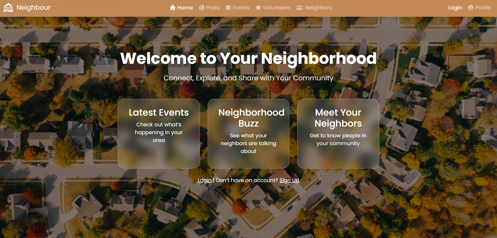

# 🌆 JAAR App — Frontend


  

## 📘 Project & Repository Description
The **JAAR App Frontend** is the client-side interface of a community-based platform that connects neighbors through posts, events, and volunteer opportunities.  
It provides users with a clean, interactive experience to browse neighborhood activities, create content, and connect with others.

This repository contains all **React** components, routes, and styling that make up the user-facing experience of the JAAR App.

---

## 🧰 Tech Stack
- **React.js**
- **React Router**
- **Axios**
- **Bootstrap / Custom CSS**
- **Font Awesome Icons**
- **JWT Authentication Integration**

---

## 🔗 Backend Repository
[JAAR App Backend](https://github.com/aisharalalwani-alt/jaar-app-backend)

---

## 🌐 Link to Deployed Site
_To be added once deployed_

---

## ⚙️ Installation Instructions (Local Server)
> The project runs on a local server (no Docker required).

```bash
# 1️⃣ Clone the repository
git clone https://github.com/aisharalalwani-alt/jaar-app-frontend.git
cd jaar-app-frontend

# 2️⃣ Install dependencies
npm install

# 3️⃣ Add environment variable for backend API
# Create a .env file and include:
REACT_APP_API_URL=http://127.0.0.1:8000

# 4️⃣ Run the app locally
npm run dev
Then open http://localhost:3000 to view the app.
 
---

```

##💎 Code I’m Proud Of ✨



This section demonstrates dynamic rendering and responsive layout design for the Home Page:

 
```python

 {/* 🔹 Glass cards with links */}
<div className="d-flex flex-column flex-md-row justify-content-center gap-4 mb-4">
  <Link to="/events" className="glass-card">
    <h3>Latest Events</h3>
    <p>Check out what’s happening in your area</p>
  </Link>

  <Link to="/posts" className="glass-card">
    <h3>Neighborhood Buzz</h3>
    <p>See what your neighbors are talking about</p>
  </Link>

  <Link to="/neighbors" className="glass-card">
    <h3>Meet Your Neighbors</h3>
    <p>Get to know people in your community</p>
  </Link>
</div>

{/* 🔹 If user not logged in */}
{!currentUser && (
  <p>
    <Link to="/login" className="text-white text-decoration-underline">
      Login
    </Link>{" "}
    | Don’t have an account?{" "}
    <Link to="/signup" className="text-white text-decoration-underline">
      Sign Up
    </Link>
  </p>
)}

{/* 🔹 If user logged in but profile incomplete */}
{currentUser && !profileComplete && (
  <p>
    Hello, {currentUser.user}!{" "}
    <Link to="/profile" className="text-white text-decoration-underline">
      Update your profile
    </Link>{" "}
    to set your location.
  </p>
)}

{/* 🔹 If user logged in and profile complete */}
{currentUser && profileComplete && (
  <p>
    Welcome back, <strong>{currentUser.user}</strong> 🌟
  </p>
)}

```


---


## 🧊 IceBox Features (Future Enhancements)
* Push notifications for new posts and events

* Profile picture upload

* Map integration for nearby events

* Real-time chat between neighbors

* Dark mode toggle

 ```


© 2025 JAAR App — Frontend | Developed by Aisha Alalwani
